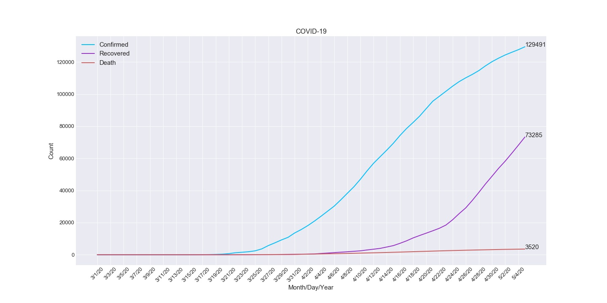
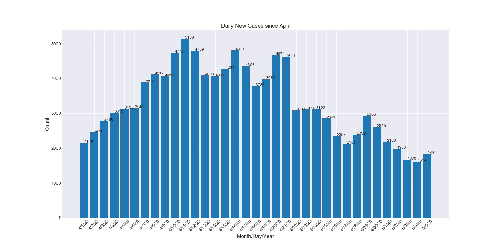
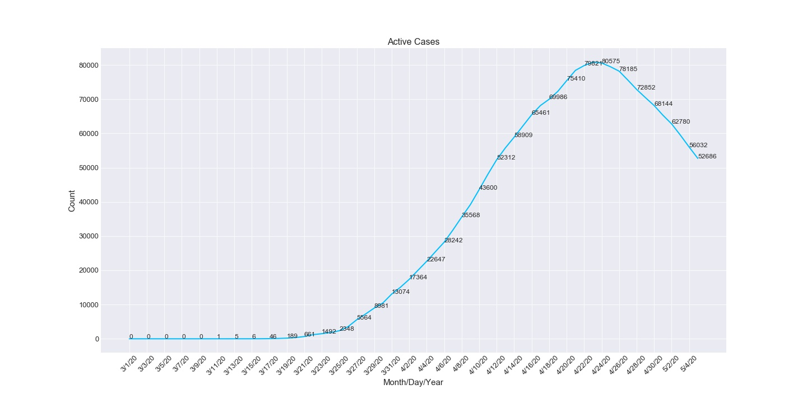

= COVID-19 Data Visualization

Python-based COVID-19 data visualization study for my bachelor course, Introduction to Big Data Analysis.

The study includes rates, daily new cases, active cases and total confirmed/death/recovery graphs.

Graphs are in this repository were obtained from Turkey's COVID-19 data.

Data source: https://github.com/CSSEGISandData/COVID-19

